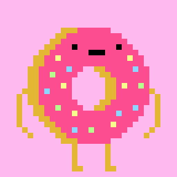
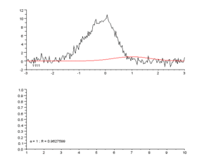

title: how to make a donut
style: style.css
author:
  name: dino-dna
  url: https://github.com/dino-dna
output: index.html
controls: true

--
# how to make a donut

- NOTES
  - CD
    - thx for showin' up
    - 10 minute not enough time for pres or content, we're going to blaze through it!
      - leave time for Qs!
    - PLEASE without haste or fear just interrupt us, really

--
### who... _are you?_

- 👋🏻 chris, general guy
- 👋🏻 cory, general guy

- NOTES
  - old chums from OSU
  - old coworkers
  - ...excited to talk you about donnies

--
### readiness-check!

- bloopers, queued
- donut-monster, growling
- hacks, hacking
- stories, telling
- jerks, crushed (i.e. little server worker buddies)
- comp audios, silenced

- NOTES
-- why
### why _are you here?_

- [coinstac](https://github.com/MRN-Code/coinstac/)
  - Collaborative Informatics and Neuroimaging Suite Toolkit for Anonymous Computation

- NOTES
 - CD
    - here show of a donut maker, but it was inspired by our prior art--a research project.
    - cory, can you explain what motivated today's presentation?
 - CR
  - COINSTAC - collaborative informatic suite <blah>
    - solves two major problems in neuroscience data sharing!
      - First: constraints placed on imaging data
        - researchers commit to maintaining participant privacy!
        - Study facilitors sometimes forbid file sharing, because...
        - it's been found that evil doers can reverse engineer brain images and derive personally identifiable information.
        - creates data silos, which is bad:
          - data would be useful to many other studies
      - CD
        - Second: portability
          - data too heavy and big to ship over network
          - people still shipping hard drives - WAT
        - no defacto tooling for coordinating data formats and analysis pipelines
        - ...more, but those are the biggins
-- so-wat

### so what did we do?

- built a distributed Machine Learning system

- NOTES
  - CD
    - SOLUTION
      - work around the constraints
        - never share the data. instead...
          - do micro analyses, and share _those_!
          - do a super analyses in the cloud to simulate _as though_ we all did one big analysis together
          - double down on thwarting evil doers by adding noise to all our data as we do micro analyses
          - ?? add pictures ??

--

### how?

- JS!
- ...but brain research happens in python & R
  - distributed docker pipelines!

- NOTES
  - CR
    - make an app to solve these things!  but how?
      - electron app, react, redux
      - node services
        - pouch, hapi, couch etc #jslyfe
    - docker for research algorithms
      - brain research happens in python & R

--
### so why are you here?

- we wanted to show it off!
- they researched "what factors contribute to Schizophrenia?"
- we researched "what factors make donuts most delicious?"
  - sneak peek of coinstac (kinda) via donuts
  - share some tinkering with DonutLearning™

- NOTES
  - CD

-- launch

### so _how do you make a donut?_

<a id="open-donuts" href="https://dino-dna.github.io/donut/#/">dino-dna.github.io/donut/</a>

- NOTES
  - CR
    - everyone, launch this app!
    - there are a few main views
      - DonutViewer
        - all donuts basic SVG elements
          - Donut SVG
          - Sprinkle SVG
    - make some donuts!
    - please, disregard the emojis
      - make the donut the way you like it, we wont judge

--

### what makes a donut delicious?

- NOTES
  - CD
    - in research, you are looking for equations that explain the world
    - one technique is called regression, visualized here
    - in this example, there are a bunch of data points, and some regression algorithm is doing it's best to make a mathmatical equation that explains these data points
      - the intent here is that the reg line is the equation that the regression creates
    - so assume that there is a global, wordly phenomenon that explains what really makes a delicious donut
      - are pips where its at?
      - are blue star where its at?
      - assuming that there is a truth to donut delicousness, we can use YOUR donuts to teach a machine what characteristics make it great
        - for example, donuts with big radii are great
        - donuts with too many sprinkles are gross
    - for ease, we've cheated, and hardcoded this magical formula into the ether

--
### DonutLearn™ Time

- launch the HACKS
- enable DONUTS, firehose mode
- watch 'em flow!

- Notes
  - CR
    - use upload button

--
### what's happening here?

- you send us donuts
- we compute a mathmatical model/equation
  - regression _learns_ an equation that explains deliciousness
  - _f(donut) = delicious-ness-score_
- we some ML goodness to maximize that equation
- we send back down our best guess to the UI
- centralized, not decentralized

- NOTES
  - CR
    - donut build process (redux, blah)
    - websockets, pure node & socketio
    - child process to docker child...
  - CD
    - where we use the defacto learning toolsuite
    - blab about scipy, numpy, etc
      - maybe blab about all MATHS in CS all ultimately use the same stuff, it just so happens the python ones get all the credit ;).  there are node linear alg things... anyway...
    - we build a regression on the fly
    - we run an optimizer, looking for maximums
      - if you want to know more about the py... ask about in during questions
    - steam it back to cory
  - CR
    - and i send it back to here! pointing to screen

--
# #bloopers

- open `VLC`, dawg.
 - `open img/bloopers`
- bulk select and `Open with...`

- NOTES
--

### plugs

- **math**.
- [cleaver](https://www.npmjs.com/package/cleaver)
  - it's like a real simple stupid revealjs
- [scikit learn](http://scikit-learn.org/stable/index.html)
- [docker](http://docker.com), obviously.  such great.
- `create-react-app`!
  - config is soooo 2016

- NOTES

--

### anti-plugs, kinda

- **dockerode**
  - great, but tricky!

- NOTES
--
### questions?
